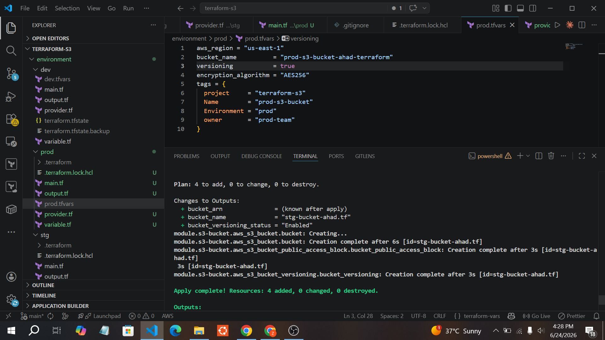
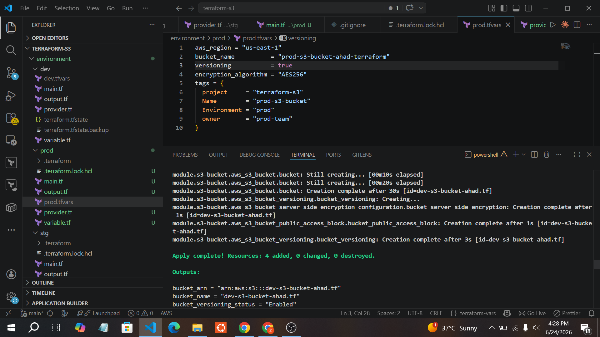
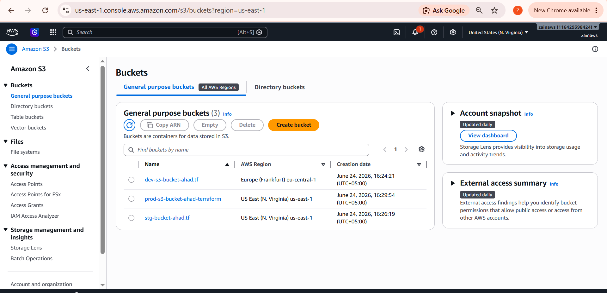
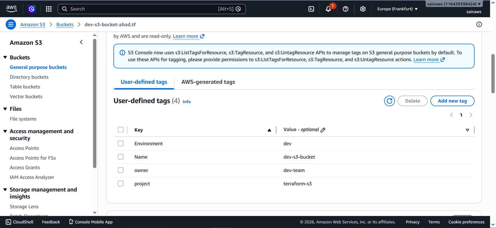
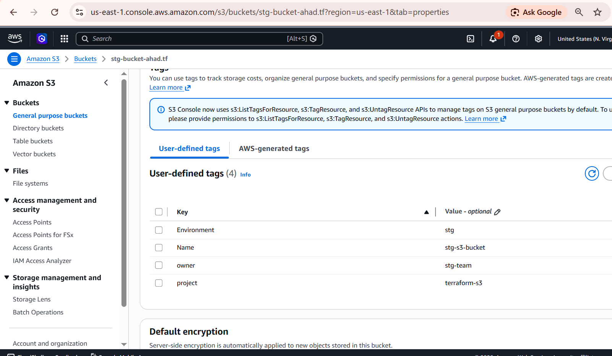
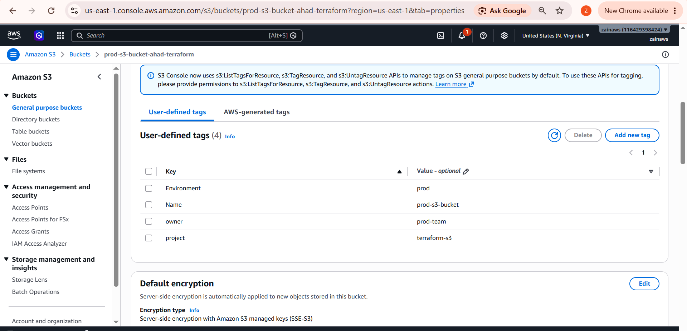

# Terraform S3 Multi-Environment Setup

Provisions an S3 bucket (with versioning, encryption, public access block, and tags) across **dev**, **staging**, and **production** environments using a single reusable Terraform module.

## Structure

```
terraform-s3/
├── module/
│   └── s3-bucket/          # Reusable S3 bucket module
│       ├── main.tf
│       ├── variables.tf
│       └── output.tf
└── environment/
    ├── dev/
    │   ├── main.tf
    │   ├── provider.tf
    │   ├── variable.tf
    │   ├── output.tf
    │   └── dev.tfvars
    ├── stg/
    │   └── ... (same files, stg.tfvars)
    └── prod/
        └── ... (same files, prod.tfvars)
```

Each environment calls the shared module with its own `.tfvars` values and maintains its **own isolated Terraform state**.

## Module Features

- S3 bucket creation
- Versioning (enable/disable via variable)
- Server-side encryption (AES256)
- Public access block (all four settings enforced)
- Environment-specific tagging (`project`, `Name`, `Environment`, `owner`)

## Usage

```bash
cd environment/<env>
terraform init
terraform plan -var-file="<env>.tfvars"
terraform apply -var-file="<env>.tfvars" --auto-approve
```

Example (prod):

```bash
cd environment/prod
terraform plan -var-file="prod.tfvars"
terraform apply -var-file="prod.tfvars" --auto-approve
```

## Outputs

Each environment exposes:
- `bucket_name`
- `bucket_arn`
- `bucket_versioning_status`

## Results

**Plan & apply output:**



**Apply complete:**



**Buckets created across all three environments (AWS Console):**



**Tags — Dev:**



**Tags — Staging:**



**Tags — Production:**



## Notes

- AWS now defaults to **Bucket owner enforced** object ownership, so ACLs are disabled unless `aws_s3_bucket_ownership_controls` is explicitly configured.
- Each environment uses a unique bucket name (e.g. `dev-s3-bucket-ahad.tf`, `stg-bucket-ahad.tf`, `prod-s3-bucket-ahad-terraform`) to avoid global S3 naming collisions.